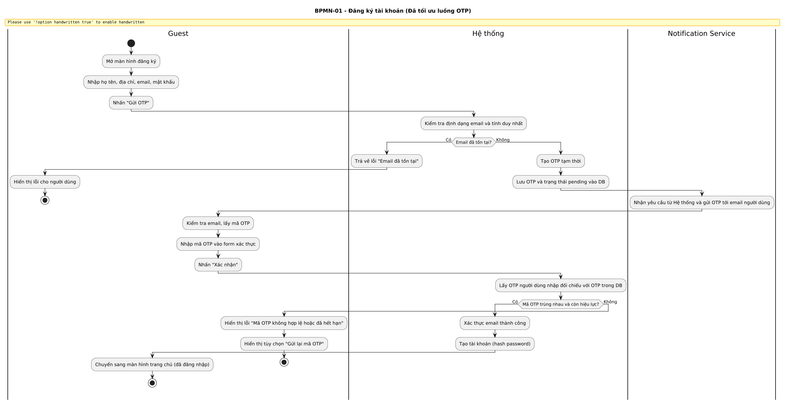
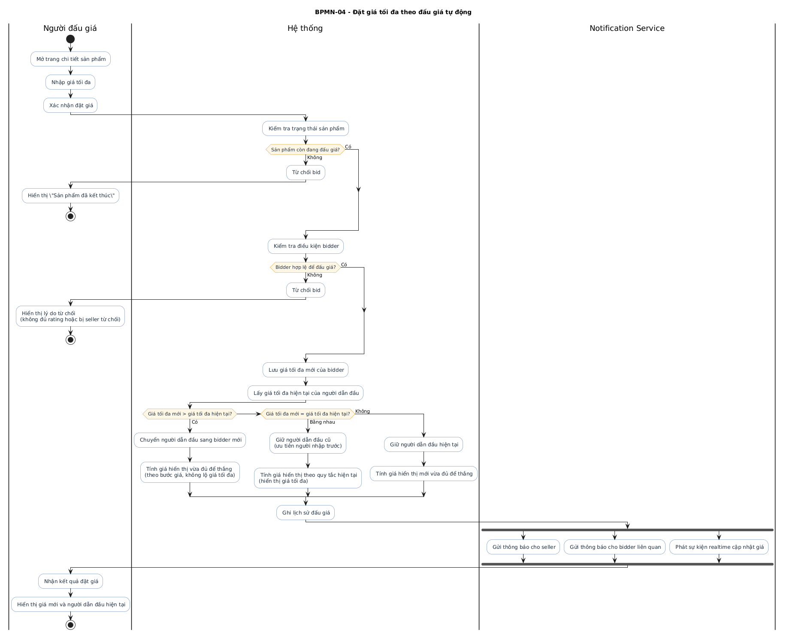
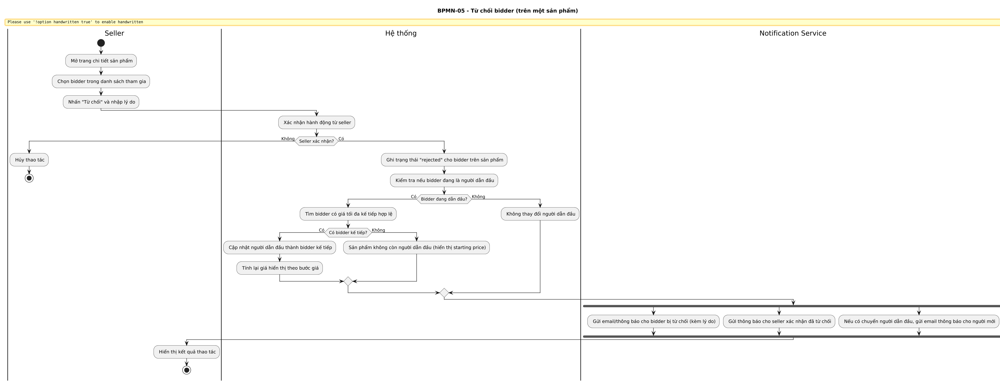

# BPMN - Sàn đấu giá trực tuyến

## 1. Thông tin tài liệu

| Hạng mục | Giá trị |
| --- | --- |
| Tên sản phẩm | Sàn đấu giá trực tuyến |
| Loại tài liệu | Danh mục quy trình BPMN |
| Phiên bản | 1.0 |
| Trạng thái | Bản nháp |
| Người phụ trách | Business Analyst |
| Ngày lập | 2026-05-29 |

## 2. Danh mục quy trình BPMN

| Mã quy trình | Tên quy trình | Swimlane chính |
| --- | --- | --- |
| BPMN-01 | Đăng ký tài khoản | Guest, Hệ thống, Email Service |
| BPMN-02 | Đăng nhập và khôi phục mật khẩu | Người dùng, Hệ thống, Email Service |
| BPMN-03 | Tìm kiếm và xem sản phẩm | Guest, Hệ thống |
| BPMN-04 | Đặt giá tối đa theo đấu giá tự động | Bidder, Hệ thống, Seller, Notification Service |
| BPMN-05 | Từ chối bidder | Seller, Hệ thống, Notification Service |
| BPMN-06 | Hỏi và trả lời sản phẩm | Bidder, Seller, Hệ thống, Email Service |
| BPMN-07 | Kết thúc đấu giá và hoàn tất đơn hàng | Winner, Seller, Hệ thống, Payment Service, Chat Service, Email Service |
| BPMN-08 | Yêu cầu và duyệt nâng cấp seller | Bidder, Administrator, Hệ thống |

## 3. Thành phần BPMN dùng trong tài liệu

- Start Event
- Task
- User Task
- Service Task
- Exclusive Gateway
- Parallel Gateway
- Intermediate Message Event
- Timer Event
- End Event
- Data Object
- Pool / Swimlane

## 4. Mẫu mô tả một quy trình

### Tên quy trình

### Mục tiêu

### Kích hoạt

### Sự kiện bắt đầu

### Sự kiện kết thúc

### Swimlane

### Luồng hoạt động chính

### Điểm quyết định

### Ngoại lệ

### Thông báo

### Dữ liệu sử dụng

### Quy tắc nghiệp vụ

## 5. Mô tả chi tiết một số quy trình

### BPMN-01 Đăng ký tài khoản

Mục tiêu: Tạo tài khoản mới và xác thực email trước khi người dùng được tham gia hệ thống.

Swimlane:

- Guest
- Hệ thống
- Email Service

Luồng hoạt động chính:

1. Guest mở màn hình đăng ký.
2. Nhập thông tin cá nhân và mật khẩu.
3. Hệ thống kiểm tra dữ liệu.
4. Hệ thống gửi OTP qua email.
5. Guest nhập OTP.
6. Hệ thống xác thực và tạo tài khoản.
7. Kết thúc quy trình.

Điểm quyết định:

- Email đã tồn tại hay chưa.
- OTP còn hiệu lực hay không.

Ảnh minh họa BPMN-01:

### BPMN-04 Đặt giá tối đa theo đấu giá tự động

Mục tiêu: Mô tả quy trình bidder nhập giá tối đa và hệ thống tự tính giá hiển thị đủ để thắng.

Swimlane:

- Bidder
- Hệ thống
- Seller
- Notification Service

Luồng hoạt động chính:

1. Bidder mở trang chi tiết sản phẩm.
2. Hệ thống hiển thị giá hiện tại đủ để thắng và bước giá.
3. Bidder nhập giá tối đa và xác nhận.
4. Hệ thống kiểm tra điều kiện rating, trạng thái sản phẩm và quyền bid.
5. Hệ thống so sánh giá tối đa mới với giá tối đa của người đang dẫn đầu.
6. Hệ thống tính lại giá hiển thị theo nguyên tắc giá vừa đủ để thắng.
7. Hệ thống cập nhật người dẫn đầu nếu cần.
8. Hệ thống ghi lịch sử và gửi thông báo cho seller và các bên liên quan.
9. Kết thúc quy trình.

Điểm quyết định:

- Bidder có đủ điều kiện đấu giá hay không.
- Giá tối đa mới có lớn hơn giá tối đa hiện tại hay không.
- Hai giá tối đa có bằng nhau hay không.

Ngoại lệ:

- Giá nhập không hợp lệ.
- Bidder bị seller từ chối.
- Sản phẩm đã kết thúc.

Quy tắc nghiệp vụ:

- Giá hiển thị chỉ là giá đủ để thắng, không phải giá tối đa.
- Cùng giá tối đa thì người nhập trước được ưu tiên.

Ảnh minh họa BPMN-04:

### BPMN-05 Từ chối bidder

Mục tiêu: Seller từ chối một bidder cụ thể trên một sản phẩm đang đấu giá.

Swimlane:

- Seller
- Hệ thống
- Notification Service

Luồng hoạt động chính:

1. Seller mở màn hình quản lý sản phẩm.
2. Seller chọn một bidder và xác nhận từ chối.
3. Hệ thống lưu trạng thái từ chối.
4. Nếu bidder này đang dẫn đầu thì hệ thống chuyển người dẫn đầu sang bidder kế tiếp có giá tối đa phù hợp.
5. Hệ thống gửi thông báo cho bidder bị từ chối.
6. Kết thúc quy trình.

Ảnh minh họa BPMN-05:

## 6. Ghi chú trình bày sơ đồ

- Mỗi quy trình nên có một sơ đồ riêng để dễ đọc và dễ chấm điểm.
- Nên giữ cùng một phong cách màu sắc và ký hiệu cho tất cả sơ đồ.
- Nên xuất sơ đồ sang PNG hoặc PDF để đính kèm vào bộ portfolio.
